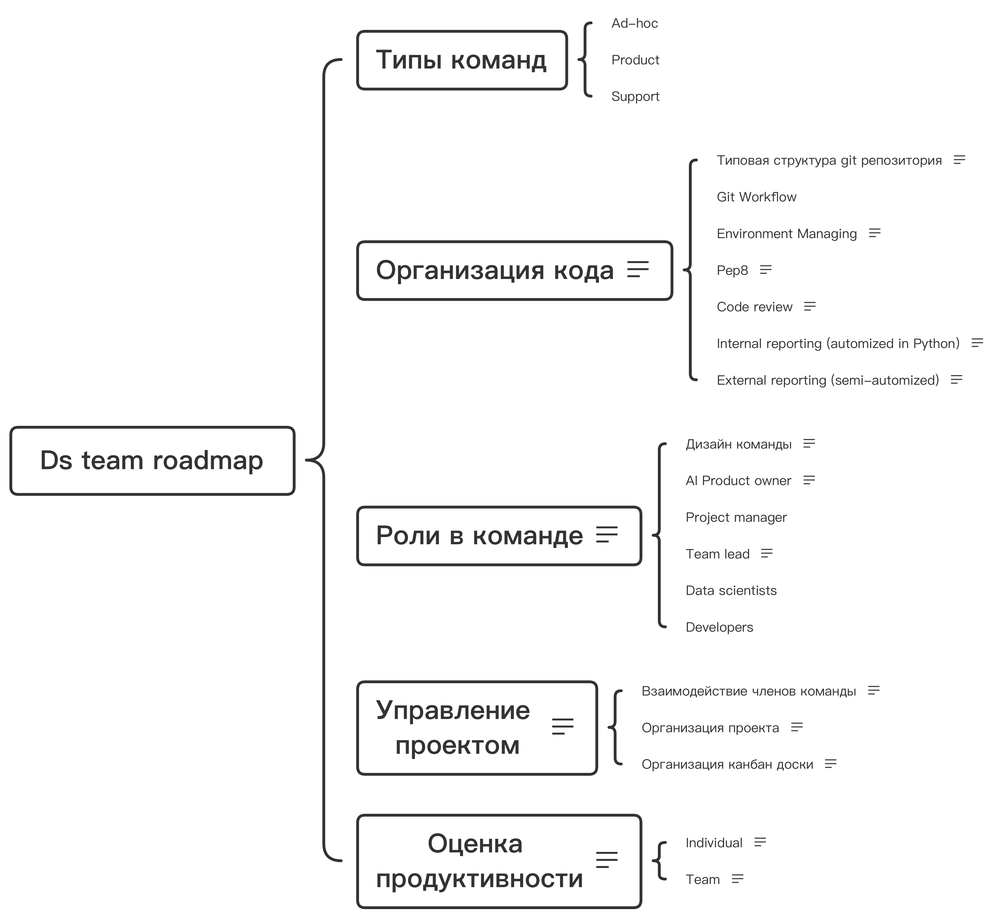
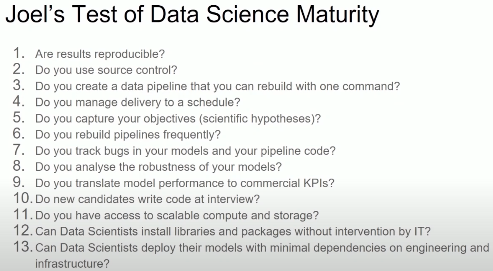
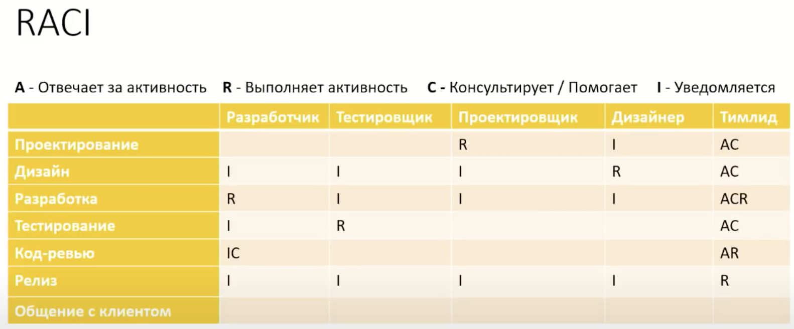
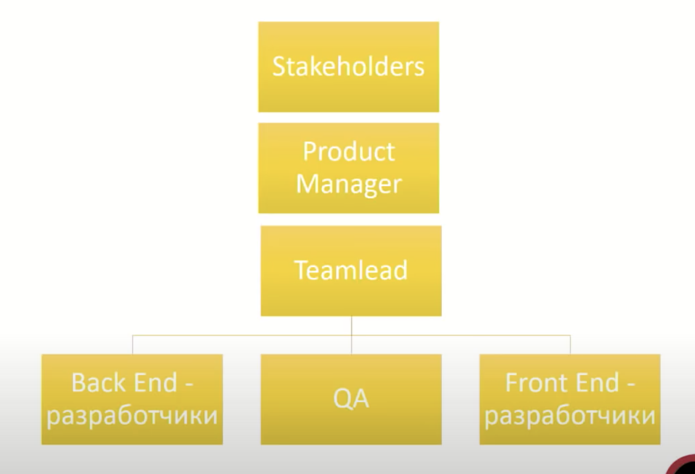

# DS-team-roadmap

- Joel's test of DS maturity:

- Responsibility assignment matrix:

- Team-customer connection:

# Ds team
## Организация кода
    Система организации кода и связанной с ним технической части проекта.

### Typical project directory structure
    #### Описание
    Структура репозитория для унификации и прозрачности работы для всех участников команды.
    
#### Ссылки
    https://github.com/dssg/hitchhikers-guide/tree/master/sources/curriculum/0_before_you_start/pipelines-and-project-workflow

### Environment (requirements)
#### Описание
    Управление зависимостями помогает управлять всеми библиотеками, необходимыми для работы приложения.
    
#### Ссылки
    https://medium.com/python-pandemonium/better-python-dependency-and-package-management-b5d8ea29dff1
    

### Pep8
#### Описание
    Единый стандарт написания кода.
    
#### Ссылки
    https://www.python.org/dev/peps/pep-0008/

### Code review
#### Описание
    Проверка исходного кода на ошибка, проблемы постановки эксперимента.
    
#### Ссылки
    https://tlroadmap.io/roles/technical-lead/product-quality/code-review.html
    

### Internal reporting (automized in Python)
#### Описание
    Заполнение документов о результатах проверки гипотез, а также внутренние отчеты (по работе моделей и тд). Процесс должен быть унифицирован и автоматизирован в начале или до начала очередного проекта.
    
#### Ссылки
    https://drive.google.com/file/d/1jahPaEie6T4hBrun4HkysXqibxntjkV_/view?usp=drivesdk
    

### External reporting (semi-automized)
#### Описание
    Внешний отчеты для заказчика/клиента/контролирующих органов. Могут составляться
    по гостам, 
    по форме, согласованной до/в процессе проекта, 
    в свободной форме.
    

## Роли в команде
    Система организации команды.

### Дизайн команды
#### Описание
    Актуально и для единой структурной единицы (лаборатории, отдела), и для проектной команды, работающей над одним бэклогом.
    
    У каждой роли свой список обязанностей (должностная инструкция) и свой круг ответственности. Обязанности и ответственность могут меняться в зависимости от проекта и этапа проекта.
    
#### Ссылки
    https://tlroadmap.io/roles/people-manager/team-management/team-design.html
    

### AI Product owner
#### Описание
    Мост между бизнесом и DS
    Понимание возможностей и ограничений DS
    Полномочия принятия решений
    Ответственность за результат с точки зрения бизнеса и потребителя
#### Ссылки

### Project manager
### Team lead
#### Описание
    Team lead - связь между продукт менеджером/ продукт овнером и членами команды. Может совмещать роли продукт менеджера, проджект менеджера.
    
    Team lead roadmap – это карта навыков и компетенций тимлидов, которую можно адаптировать для любой компании и команды.
    
#### Ссылки
    https://github.com/tlbootcamp/tlroadmap

### Data scientists
### Developers
## Управление проектом
    Система организации проектной деятельности.
    

### Взаимодействие
#### Описание
    Планируемые встречи (взаимодействие команды): 
    брейнстормы - для наполнения бэклога и определения архитектуры решения (раз в 2 недели)
    Стендапы - для обеспечения прозрачности и выявления рисков/проблем (ежедневно, через день)
    Ретроспективы (ретро) - для настройки процесса и понимания слабых мест (раз в 2 недели)
#### Ссылки

### Организация проекта
#### Описание
    Система, описывающая все процессы взаимодействия с внешними и внутренними лицами и исполнителями.
    
#### Ссылки
    https://youtu.be/HJML5Ghz-hk

### Организация канбан доски
#### Описание
    Канбан доска создаётся на основе болей и проблем команды, чтобы она была вспомогательным инструментом в работе и в обеспечении качества проекта.
    
#### Ссылки
    
    

## Оценка продуктивности
    Оценка личной и командной продуктивности. Процесс может быть выстроен как регулярный анализ и разбор метрик продуктивности (пример команды) или как регулярные performance review (пример члена команды).

### Individual
#### Описание
    Оценка эффективности членов команды чаще всего проходит с помощью регулярных performance review. Performance review - это инструмент измерения эффективности члена команды.
    
    Как часто:
    По времени (раз в квартал)
    По проектам (после каждого крупного проекта)
    Дополнительно использовать one-on-one Тим Лида с каждым членом команды, чтобы рассказать результаты ревью, собрать обратную связь, а также обсудить вопросы, которые лучше не выносить на публику.
    
#### Ссылки
    https://youtu.be/HKXJ_AWPVBA

### Team
#### Описание
    Оценка эффективности команды. Можно через ttm и другие продуктовые метрики.
    
#### Ссылки
    https://youtu.be/c0CRiCeJ99s
    

